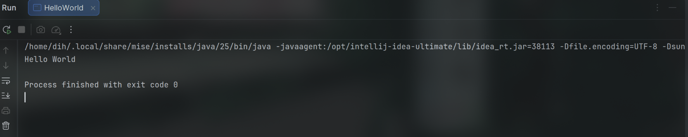

## JDK Version Used

OpenJDK 25
## Hello World Program

**Create a file named HelloWorld.java**

```
public class HelloWorld {
    public static void main(String[] args) {
        System.out.println("Hello World");
    }
}
```
**Compile using the below command**

``javac HelloWorld.java``

**Run:**

``java HelloWorld``

or just run the program directly in your IDE

**Output:**

